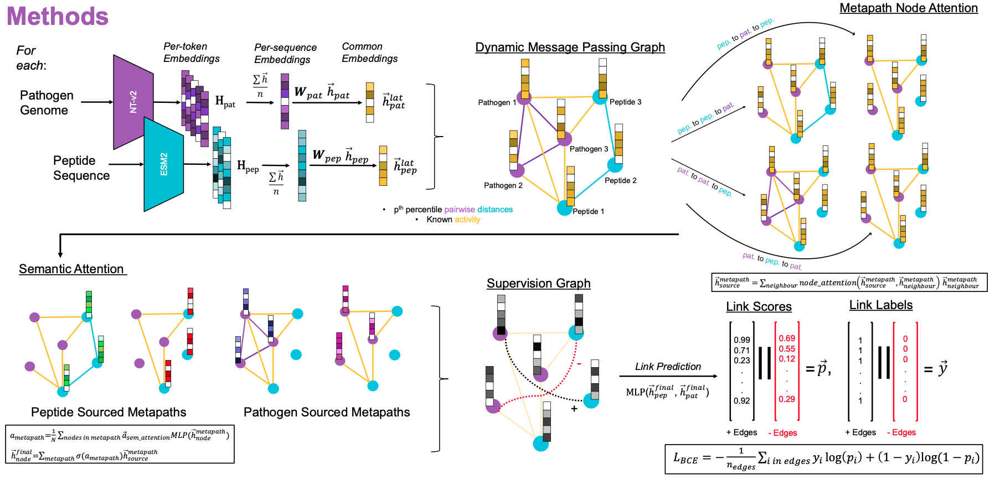

# triAMPh - TaRget Identification of AntiMicrobial Peptides with Heterogeneous graph attention networks
triAMPh is a heterogeneous graph attention network based species-specific antimicrobial bioactivity predictor. It also gives the users to flexibly define their own peptide and pathogen features. In this study, we used [ESM2](https://github.com/facebookresearch/esm) and [NucleotideTransformerv2](https://github.com/instadeepai/nucleotide-transformer) embeddings for peptides and pathogens respectively as their feature vectors. As a backbone, [this implementation](https://github.com/dmlc/dgl/tree/master/examples/pytorch/han) of [HAN paper](https://arxiv.org/abs/1903.07293) was adapted.

# Files: 
* `constants.py:` Contains the constants used for triAMPh in a single file.
* `dataset.py:` Contains the data wrapper classes for training and testing scripts.
* `model.py:` Contains the deep learning models for triAMPh.
* `predict.py:` Prediction for discovery script. If the labels are unknown use this.
* `test.py:` The testing script for triAMPh, if the labels are known.
* `train.py:` The training, validation, and optionally testing script for triAMPh.
* `utils.py:` Helper functions.



# Running triAMPh:

## Training and Validation:
Here, we expect users to specify one positive edge file and one negative edge file. triAMPh, based on user specified partitioning portions, splits the dataset into training, validation, and if they do not add up to 100%, testing sets.

```
train.py [-h] -p POSITIVE_EDGES -n NEGATIVE_EDGES -e PROTEIN_EMB_DIR -g GENOMIC_EMB_DIR -o OUTPUT_DIR [--prefix PREFIX] [--tr_split TR_SPLIT] [--val_split VAL_SPLIT]
                [--msg_pas MSG_PAS] [--inductive INDUCTIVE] [--lr LR] [--epochs EPOCHS] [--dropout DROPOUT] [--seed SEED] [--patience PATIENCE] [--epsilon EPSILON]
                --gen_emb_size GEN_EMB_SIZE --prot_emb_size PROT_EMB_SIZE [--han_input_size HAN_INPUT_SIZE] [--han_hidden_size HAN_HIDDEN_SIZE] [--n_heads N_HEADS]
                [--semantic_att_size SEMANTIC_ATT_SIZE] [--self_emb_semantic SELF_EMB_SEMANTIC] [--p_percentile P_PERCENTILE] [--g_percentile G_PERCENTILE]

options:
  -h, --help            show this help message and exit
  -p POSITIVE_EDGES, --positive_edges POSITIVE_EDGES
                        Path to the file that contains the positive edges. Expects a .csv file.
  -n NEGATIVE_EDGES, --negative_edges NEGATIVE_EDGES
                        Path to the file that contains the negative edges. Expects a .csv file.
  -e PROTEIN_EMB_DIR, --protein_emb_dir PROTEIN_EMB_DIR
                        Path to the folder that contains the individual embeddings of peptides. Note: Files should be saved in .npy format.
  -g GENOMIC_EMB_DIR, --genomic_emb_dir GENOMIC_EMB_DIR
                        Path to the folder that contains the individual embeddings of pathogens. Note: Files should be saved in .npy format.
  -o OUTPUT_DIR, --output_dir OUTPUT_DIR
                        Path to the directory where the results will be saved at
  --prefix PREFIX       Prefix to be added to the filenames of the plots and weights generated.
  --tr_split TR_SPLIT   Percentage of the training split from the provided data.
  --val_split VAL_SPLIT
                        Percentage of the validation split from the provided data.
  --msg_pas MSG_PAS     Percentage of the edges to be used for message passing.
  --inductive INDUCTIVE
                        Training strategy: Inductive if 1, transductive otherwise.
  --lr LR               Learning rate for training.
  --epochs EPOCHS       Number of epochs to train for.
  --dropout DROPOUT     Dropout percentage for Heterogeneous Graph Attention Network.
  --seed SEED           Random seed to be set.
  --patience PATIENCE   Early stopper patience.
  --epsilon EPSILON     Early stopper epsilon.
  --gen_emb_size GEN_EMB_SIZE
                        Length of the genomic embedding vector.
  --prot_emb_size PROT_EMB_SIZE
                        Length of the protein embedding vector.
  --han_input_size HAN_INPUT_SIZE
                        Input length of the projected node vectors given to the Heterogeneous Graph Attention Network.
  --han_hidden_size HAN_HIDDEN_SIZE
                        Length of the hidden/output node vectors of the Heterogeneous Graph Attention Network.
  --n_heads N_HEADS     Number of attention heads for Heterogeneous Graph Attention Network.
  --semantic_att_size SEMANTIC_ATT_SIZE
                        The size of the semantic attention vector.
  --self_emb_semantic SELF_EMB_SEMANTIC
                        The strategy that will be used for self embedding inclusion. 1 for semantic attention level, otherwise graph attention level.
  --p_percentile P_PERCENTILE
                        The percentile cutoff value for pairwise peptide distances to be used for graph building.
  --g_percentile G_PERCENTILE
                        The percentile cutoff value for pairwise genome distances to be used for graph building.
```

## Testing:
Here, we expect users to specify one positive edge file and one negative edge file each for message passing and testing/supervision.

```
usage: test_triAMPh.py [-h] -p POSITIVE_EDGES -n NEGATIVE_EDGES -t TEST_POSITIVE_EDGES -a TEST_NEGATIVE_EDGES -e PROTEIN_EMB_DIR -g GENOMIC_EMB_DIR -o OUTPUT_DIR -w WEIGHT_PATH [--threshold THRESHOLD] --gen_emb_size
                       GEN_EMB_SIZE --prot_emb_size PROT_EMB_SIZE [--han_input_size HAN_INPUT_SIZE] [--han_hidden_size HAN_HIDDEN_SIZE] [--n_heads N_HEADS] [--seed SEED]

arguments:
  test.py [-h] -p POSITIVE_EDGES -n NEGATIVE_EDGES -t TEST_POSITIVE_EDGES -a TEST_NEGATIVE_EDGES -e PROTEIN_EMB_DIR -g GENOMIC_EMB_DIR -o OUTPUT_DIR [--prefix PREFIX]

options:
  -h, --help            show this help message and exit
  -p POSITIVE_EDGES, --positive_edges POSITIVE_EDGES
                        Path to the file that contains the message passing positive edges. Expects a .csv file.
  -n NEGATIVE_EDGES, --negative_edges NEGATIVE_EDGES
                        Path to the file that contains the message passing negative edges. Expects a .csv file.
  -t TEST_POSITIVE_EDGES, --test_positive_edges TEST_POSITIVE_EDGES
                        Path to the file that contains the supervision/test positive edges. Expects a .csv file.
  -a TEST_NEGATIVE_EDGES, --test_negative_edges TEST_NEGATIVE_EDGES
                        Path to the file that contains the supervision/test negative edges. Expects a .csv file.
  -e PROTEIN_EMB_DIR, --protein_emb_dir PROTEIN_EMB_DIR
                        Path to the folder that contains the individual embeddings of peptides. Note: Files should be saved in .npy format.
  -g GENOMIC_EMB_DIR, --genomic_emb_dir GENOMIC_EMB_DIR
                        Path to the folder that contains the individual embeddings of pathogens. Note: Files should be saved in .npy format.
  -o OUTPUT_DIR, --output_dir OUTPUT_DIR
                        Output directory of the triAMPh model of interest. Weights would be located in a subfolder of this directory.
  --prefix PREFIX       Prefix added to the filenames of the plots and weights of interest.
```

## Predict:
The predictions for the peptide-pathogen pairs in the `--query_edges` file with the triAMPh scores will be written to `--output_dir/filename`. 
```
predict.py [-h] -p POSITIVE_EDGES -n NEGATIVE_EDGES -t QUERY_EDGES -e PROTEIN_EMB_DIR -g GENOMIC_EMB_DIR -o OUTPUT_DIR [--prefix PREFIX] [--filename FILENAME]

options:
  -h, --help            show this help message and exit
  -p POSITIVE_EDGES, --positive_edges POSITIVE_EDGES
                        Path to the file that contains the message passing positive edges. Expects a .csv file.
  -n NEGATIVE_EDGES, --negative_edges NEGATIVE_EDGES
                        Path to the file that contains the message passing negative edges. Expects a .csv file.
  -t QUERY_EDGES, --query_edges QUERY_EDGES
                        Path to the file that contains the edges to be predicted. Expects a .csv file.
  -e PROTEIN_EMB_DIR, --protein_emb_dir PROTEIN_EMB_DIR
                        Path to the folder that contains the individual embeddings of peptides. Note: Files should be saved in .npy format.
  -g GENOMIC_EMB_DIR, --genomic_emb_dir GENOMIC_EMB_DIR
                        Path to the folder that contains the individual embeddings of pathogens. Note: Files should be saved in .npy format.
  -o OUTPUT_DIR, --output_dir OUTPUT_DIR
                        Output directory of the triAMPh model of interest. Weights would be located in a subfolder of this directory. This will also be the folder the results will be written to.
  --prefix PREFIX       Prefix added to the filenames of the plots and weights of interest.
  --filename FILENAME   Name of the file that the results will be written to. Append .csv to the end.
```

# Expected Inputs:
triAMPh expects the inputs in a specific format. In this section, the formatting will be discussed.

## Edge Files:
We expect edge files to contain peptide IDs under the column `ID`, peptide sequences under the column `Sequences`, and pathogen names under the column `Pathogens`. The format of a file is expected to be a `.csv`. 

## Embedding Files:
triAMPh expects embeddings to be 2D arrrays saved in a separate `.npy` file for each peptide/pathogen. Here, the important thing is to make the file names match with IDs/pathogen names specified in the edge file. 

# Contact:
Please use Github issues for problems related to the code and contact bucar at bccancer.ca for further inquiries.
