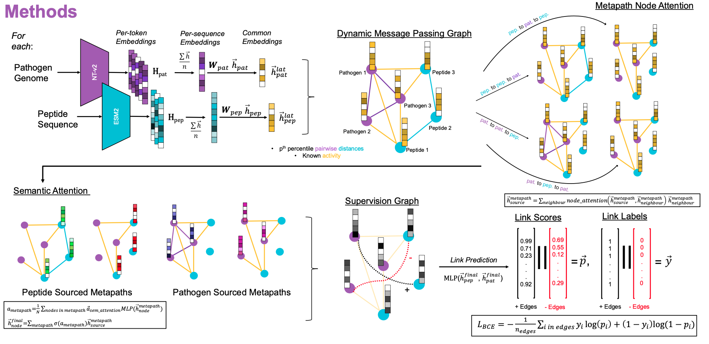

# triAMPh
TaRget Identification of AntiMicrobial Peptides with Heterogenious graph attention networks
triAMPh is a heteregenous graph attention network based species-specific antimicrobial bioactivity predictor. It also gives the users to flexibly define their own peptide and pathogen features. In this study, we used [ESM2](https://github.com/facebookresearch/esm) and [NucleotideTransformerv2](https://github.com/instadeepai/nucleotide-transformer) embeddings for peptides and pathogens respectively as their feauture vectors. As a backbone, [this implementation](https://github.com/dmlc/dgl/tree/master/examples/pytorch/han) of [HAN paper](https://arxiv.org/abs/1903.07293) was adapted.

# Files: 
* `data:` Contains the master data file used for training, validation, and testing.
  * `data/stratified:` Specifically contains the training, validation, test split as well as message passing portions of the master data for competitor method developers convenience.
  * `data/protein_embs:` Contains the example peptide embeddings. For each peptide, a single .npy file that contains a 2D array (per token/amino acid) embeddings. We expect users to follow this format. Here, we were only able to provide a subset of our trained peptides. If you want to reproduce the results please refer to [ESM2](https://github.com/facebookresearch/esm)'s `extract.py` script and generate per_token embeddings with their defualt model.
  * `data/genomic_embs:` Contains the example pathogen embeddings. For each pathogen, a single .npy file that contains a 2D array (per token/5.1kmer in our training scheme) embeddings. We expect users to follow this format.
  * `data/weights_selected:` Contains the weights from our hyperparameter tuning rounds we selected as our best performance providing one. It uses the default configuration of the model.
* `imgs:` Contains the abstract images for the readme file.
* `results:` Contains how an example result folder will be generated after the training process.
  * `results/weights:` Contains the weights generated by each training process.
  * `results/accs:` Contains the accuracy plots generated by each training run.
  * `results/losses:` Contains the loss plots generated by each training run.
* `src:` Contains the code for triAMPh:
  * `src/constants.py:` Contains the constants used for triAMPh in a single file.
  * `src/dataset.py:` Contains the data wrapper classes for training and testing scripts.
  * `src/model.py:` Contains the deep learning models for triAMPh.
  * `src/train_triAMPh.py:` The training, validation, and optionally testing script for triAMPh.
  * `src/test_triAMPh.py:` The testing script for triAMPh.
* `triAMPh_env.yml:` Contains the dependencies needed to run triAMPh.



# Installation:

1. Please clone this repository by running:
```
git clone https://github.com/bcgsc/triAMPh.git
```

2. In order to run triAMPh, you need to download the dependencies specified in `triAMPh_env.yml`. Please run the following command to create the environment.

```
conda env create -f triAMPh_env.yml.yml
```

3. Activate the environment by running:

```
conda activate triAMPh
```

4. You are all set!

# Running triAMPh:

## Training and Validation:
Here, we expect users to specify one positive edge file and one negative edge file. triAMPh, based on user specified partitioning portions, splits the dataset into training, validation, and if they do not add up to 100%, testing sets.

```
usage: train_triAMPh.py [-h] -p POSITIVE_EDGES -n NEGATIVE_EDGES -e PROTEIN_EMB_DIR -g GENOMIC_EMB_DIR -o OUTPUT_DIR [--prefix PREFIX] [--tr_split TR_SPLIT] [--val_split VAL_SPLIT] [--msg_pas MSG_PAS]
                        [--inductive INDUCTIVE] [--lr LR] [--epochs EPOCHS] --gen_emb_size GEN_EMB_SIZE --prot_emb_size PROT_EMB_SIZE [--han_input_size HAN_INPUT_SIZE] [--han_hidden_size HAN_HIDDEN_SIZE]
                        [--n_heads N_HEADS] [--dropout DROPOUT] [--seed SEED]

arguments:
  -h, --help            show this help message and exit
  -p POSITIVE_EDGES, --positive_edges POSITIVE_EDGES
                        Path to the file that contains the positive edges. Expects a .csv file.
  -n NEGATIVE_EDGES, --negative_edges NEGATIVE_EDGES
                        Path to the file that contains the negative edges. Expects a .csv file.
  -e PROTEIN_EMB_DIR, --protein_emb_dir PROTEIN_EMB_DIR
                        Path to the folder that contains the individual embeddings of peptides. Note: Files should be saved in .npy format.
  -g GENOMIC_EMB_DIR, --genomic_emb_dir GENOMIC_EMB_DIR
                        Path to the folder that contains the individual embeddings of pathogens. Note: Files should be saved in .npy format.
  -o OUTPUT_DIR, --output_dir OUTPUT_DIR
                        Path to the directory where the results will be saved at
optional arguments:
  --prefix PREFIX       Prefix to be added to the filenames of the plots and weights generated.
  --tr_split TR_SPLIT   Percentage of the training split from the provided data.
  --val_split VAL_SPLIT
                        Percentage of the validation split from the provided data.
  --msg_pas MSG_PAS     Percentage of the edges to be used for message passing.
  --inductive INDUCTIVE
                        Training strategy: Inductive if 1, transductive otherwise.
  --lr LR               Learning rate for training.
  --epochs EPOCHS       Number of epochs to train for.
  --gen_emb_size GEN_EMB_SIZE
                        Length of the genomic embedding vector.
  --prot_emb_size PROT_EMB_SIZE
                        Length of the protein embedding vector.
  --han_input_size HAN_INPUT_SIZE
                        Input length of the projected node vectors given to the Heterogeneous Graph Attention Network.
  --han_hidden_size HAN_HIDDEN_SIZE
                        Length of the hidden/output node vectors of the Heterogeneous Graph Attention Network.
  --n_heads N_HEADS     Number of attention heads for Heterogeneous Graph Attention Network.
  --dropout DROPOUT     Dropout percent for Heterogeneous Graph Attention Network.
  --seed SEED           Random seed to be set.
```
**Example usage:**
```
python src/train_triAMPh.py\
  -p data/positive_edges_triAMPh.csv -n data/negative_edges_triAMPh.csv\
  -e data/protein_embs -g data/genomics_embs -o results\
  --gen_emb_size 512 --prot_emb_size 1280 --epochs 100 --prefix example
```
## Testing:
Here, we expect users to specify one positive edge file and one negative edge file each for message passing and testing/supervision.

```
usage: test_triAMPh.py [-h] -p POSITIVE_EDGES -n NEGATIVE_EDGES -t TEST_POSITIVE_EDGES -a TEST_NEGATIVE_EDGES -e PROTEIN_EMB_DIR -g GENOMIC_EMB_DIR -o OUTPUT_DIR -w WEIGHT_PATH [--threshold THRESHOLD] --gen_emb_size
                       GEN_EMB_SIZE --prot_emb_size PROT_EMB_SIZE [--han_input_size HAN_INPUT_SIZE] [--han_hidden_size HAN_HIDDEN_SIZE] [--n_heads N_HEADS] [--seed SEED]

arguments:
  -h, --help            show this help message and exit
  -p POSITIVE_EDGES, --positive_edges POSITIVE_EDGES
                        Path to the file that contains the message passing positive edges. Expects a .csv file.
  -n NEGATIVE_EDGES, --negative_edges NEGATIVE_EDGES
                        Path to the file that contains the message passing negative edges. Expects a .csv file.
  -t TEST_POSITIVE_EDGES, --test_positive_edges TEST_POSITIVE_EDGES
                        Path to the file that contains the message passing positive edges. Expects a .csv file.
  -a TEST_NEGATIVE_EDGES, --test_negative_edges TEST_NEGATIVE_EDGES
                        Path to the file that contains the message passing negative edges. Expects a .csv file.
  -e PROTEIN_EMB_DIR, --protein_emb_dir PROTEIN_EMB_DIR
                        Path to the folder that contains the individual embeddings of peptides. Note: Files should be saved in .npy format.
  -g GENOMIC_EMB_DIR, --genomic_emb_dir GENOMIC_EMB_DIR
                        Path to the folder that contains the individual embeddings of pathogens. Note: Files should be saved in .npy format.
  -o OUTPUT_DIR, --output_dir OUTPUT_DIR
                        Path to the directory where the results will be saved at
  -w WEIGHT_PATH, --weight_path WEIGHT_PATH
                        Path to the pretrained weights of triAMPh.
optional arguments:
  --threshold THRESHOLD 
                        Threshold value for binary cross entropy. Default: Above 0.5 positive, below negative.
  --gen_emb_size GEN_EMB_SIZE
                        Length of the genomic embedding vector.
  --prot_emb_size PROT_EMB_SIZE
                        Length of the protein embedding vector.
  --han_input_size HAN_INPUT_SIZE
                        Input length of the projected node vectors given to the Heterogeneous Graph Attention Network.
  --han_hidden_size HAN_HIDDEN_SIZE
                        Length of the hidden/output node vectors of the Heterogeneous Graph Attention Network.
  --n_heads N_HEADS     Number of attention heads for Heterogeneous Graph Attention Network.
  --seed SEED           Random seed to be set.
```
**Example usage:**
```
python src/test_triAMPh.py\
  -p data/split/msg_positive_edges.csv -n data/split/msg_negative_edges.csv\
  --test_positive_edges data/split/test_positive_edges.csv --test_negative_edges data/split/test_negative_edges.csv\
  -e data/protein_embs -g data/genomic_embs\
  -o results --weight_path results/weights/weight_2025-03-19_11-00-08.pth\
  --gen_emb_size 512 --prot_emb_size 1280
```

# Expected Inputs:
triAMPh expects the inputs in a specific format. In this section, the formatting will be discussed.

## Edge Files:
We expect edge files to contain peptide IDs under the column `ID`, peptide sequences under the column `Sequences`, and pathogen names under the column `Pathogens`. The format of a file is expected to be a `.csv`. 

## Embedding Files:
triAMPh expects embeddings to be 2D arrrays saved in a separate `.npy` file for each peptide/pathogen. Here, the important thing is to make the file names match with IDs/pathogen names specified in the edge file. 

